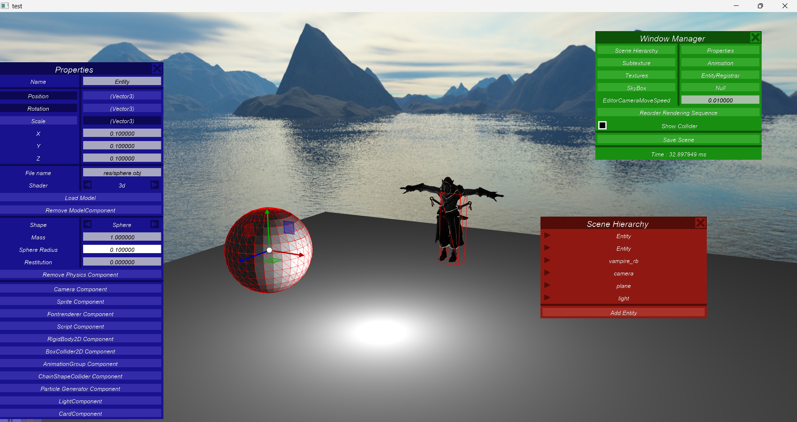

# Build Project

    cmake .

1. Generate Files in same Folder.
2. Open Game_Engine.sln
3. Run

# Game Engine Tutorial

1. Ctrl + E to Open EditorMode of Engine
2. Alt + C in EditorMode to Open Console

    ## Console Commands:

        1. reset
        2. load scene_name

3. Alt + 3 in EditorMode to Set Camera into 3 Axis Camera for move camera in 3 dimension.

     Press Right click of mouse and drag mouse to change view direction.

# Game Engine Screenshots
